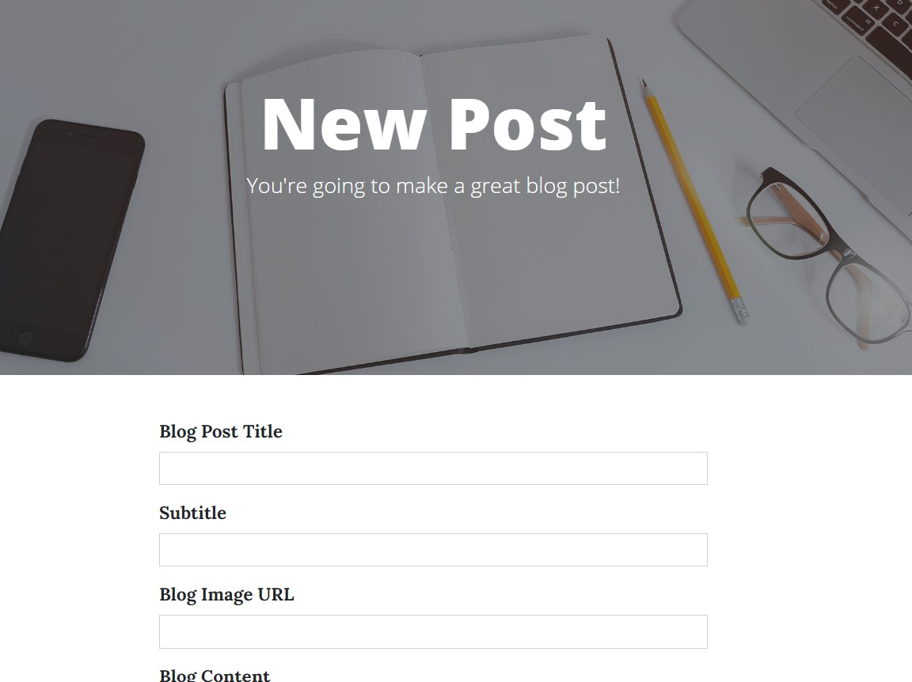

# Blog app (Flask)
Simple blog app built with Flask.
## Home page
The main page displays the entire list of posts written by the blog owner. All records are stored in a database.

## Add post
The main user can add, delete and modify already existing posts.

## Registration
Using the registration page, new users can create an account. After that, they will be able to comment on the posts.

## Comments

## Contact Me
Any users can send their message to the blog owner's mail.

## Languages
+ Python
+ HTML and Jinja
+ CSS
+ JavaScript
  
## Technologies
+ Flask
+ WTForms
+ SQLAlchemy
+ Bootstrap5
+ Flask-Login
